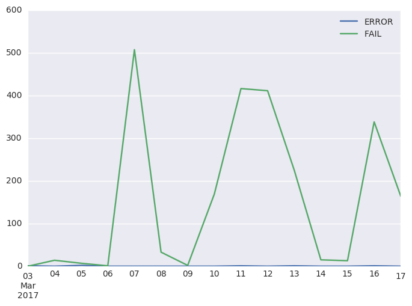

Test Results in ActiveData
==========================
Our automated test results are publicly accessible via
`ActiveData <https://wiki.mozilla.org/Auto-tools/Projects/ActiveData>`_, which
allows us to determine areas the need attention. For example, we might want to
identify tests that take the longest to run, or tests that fail most often. We
can also use ActiveData to see if changing the version of Python or a package
has an effect on the duration or outcome of the tests.

Most of our test automation is based on pytest, and in order to these results
into ActiveData we need to generate structured logs and upload them to an
Amazon S3 bucket. ActiveData scans this bucket, ingests the logs, and the
results are then available for querying.

Structured logs
---------------
Many test suites at Mozilla use
`mozlog <http://mozbase.readthedocs.io/en/latest/mozlog.html>`_ to generate
structured logs. As ActiveData is already familiar with this format, it makes
sense to reuse it for our test results. To achieve this, mozlog includes a
simple pytest plugin named
`pytest-mozlog <https://dxr.mozilla.org/mozilla-central/source/testing/mozbase/mozlog/mozlog/pytest_mozlog/plugin.py>`_.
When mozlog is installed, additional command line options are added to pytest
for generating logs in the various available formats. For example, to generate
a structured log::

  pytest --log-raw=raw.log

Other formats are available, however the raw format is the only one that
ActiveData will be able to process. Here's an example of the output::

  {"pid": 92739, "run_info": {"Python": "2.7.10", "Plugins": {"mozlog": "3.4", "xdist": "1.15.0", "base-url": "1.3.0", "metadata": "1.3.0", "html": "1.14.2"}, "Packages": {"pytest": "3.0.6", "pluggy": "0.4.0", "py": "1.4.32"}, "Platform": "Darwin-16.4.0-x86_64-i386-64bit"}, "action": "suite_start", "tests": ["test_foo.py::test_foo", "test_bar.py::test_bar"], "component": "pytest", "source": "pytest", "time": 1489585066381, "thread": "MainThread"}
  {"pid": 92739, "test": "test_foo.py::test_foo", "action": "test_start", "component": "pytest", "source": "pytest", "time": 1489585071631, "thread": "MainThread"}
  {"pid": 92739, "test": "test_bar.py::test_bar", "action": "test_start", "component": "pytest", "source": "pytest", "time": 1489585071631, "thread": "MainThread"}
  {"status": "PASS", "pid": 92739, "test": "test_foo.py::test_foo", "action": "test_end", "component": "pytest", "source": "pytest", "time": 1489585072217, "thread": "MainThread"}
  {"status": "PASS", "pid": 92739, "test": "test_foo.py::test_bar", "action": "test_end", "component": "pytest", "source": "pytest", "time": 1489585072219, "thread": "MainThread"}
  {"pid": 92739, "action": "suite_end", "component": "pytest", "source": "pytest", "time": 1489585072594, "thread": "MainThread"}

Metadata
--------
In order to add context to the results we use the
`pytest-metadata <https://pypi.python.org/pypi/pytest-metadata/>`_ plugin. This
adds details on the platform, Python binary, pytest packages, and pytest
plugins used in the test session. It also adds environment variables from
several continuous integrations servers, and we use this to associate results
with a specific application under test. All of this data is added to the
``run_info`` in the ``suite_start`` message within the structured log.

Querying ActiveData
-------------------
You can use the
`ActiveData Query Tool <https://activedata.allizom.org/tools/query.html>`_ to
run queries and see the responses from ActiveData. The
`getting started <https://github.com/klahnakoski/ActiveData/blob/dev/docs/GettingStarted.md>`_
guide is a good place to start, however let's explore a couple of examples.

Test durations
~~~~~~~~~~~~~~
The following query will return the 90th percentile for test duration, grouped
by test name and job:

.. code:: json

  {
    "from":"fx-test",
    "limit":1000,
    "groupby":["test.full_name"],
    "select":[{
      "aggregate":"percentile",
      "percentile":0.9,
      "value":"result.duration"
    }]
  }

You'll need to sort the results in the client to determine the longest running
tests. Then you may want to do further queries to learn if these tests are
longer against different environments, or across the board. This might
highlight tests that are doing too much, or at least slowing down the feedback
loop.

Failing tests
~~~~~~~~~~~~~
The following query will return the total number of times each test has failed.

.. code:: json

  {
    "from":"fx-test",
    "limit":1000,
    "groupby":["test.full_name"],
    "where":{"eq":{"result.ok":false}},
    "select":[{"aggregate":"count"}]
  }

Note that this doesn't distinguish between the various outcomes that evaluate
as a failure, so this is just wherever the outcome does not match the
expectation.

Plotting results
----------------
A useful way to visualize the results from ActiveData is to plot them on a
chart. This can be achieved using a `Jupyter Notebook <https://jupyter.org/>`_,
with pandas, NumPy, and matplotlib. If you have `Docker <http://docker.com/>`_
installed then a really quick way to get started is to use the
`jupyter/datascience-notebook <https://hub.docker.com/r/jupyter/datascience-notebook/>`_
image::

  $ docker run -it --rm -p 8888:8888 jupyter/datascience-notebook
  [I 17:58:11.744 NotebookApp] Writing notebook server cookie secret to /home/jovyan/.local/share/jupyter/runtime/notebook_cookie_secret
  [W 17:58:12.747 NotebookApp] WARNING: The notebook server is listening on all IP addresses and not using encryption. This is not recommended.
  [I 17:58:12.814 NotebookApp] Serving notebooks from local directory: /home/jovyan/work
  [I 17:58:12.814 NotebookApp] 0 active kernels
  [I 17:58:12.814 NotebookApp] The Jupyter Notebook is running at: http://[all ip addresses on your system]:8888/?token=[TOKEN]
  [I 17:58:12.814 NotebookApp] Use Control-C to stop this server and shut down all kernels (twice to skip confirmation).
  [C 17:58:12.824 NotebookApp]

      Copy/paste this URL into your browser when you connect for the first time,
      to login with a token:
          http://localhost:8888/?token=[TOKEN]

Open Jupyter at the URL provided and create a new Notebook with your preferred
Python version.

In the first cell, build your query. The following will return all failing
tests run in the last two weeks by day and outcome, which will allow us to
plot the outcomes on a chart:

.. code:: python

  query = """{
  "from":"fx-test",
  "edges":[
    {"value":"result.result","allowNulls":false},
    {
      "value":"result.end_time",
      "allowNulls":false,
      "domain":{
        "type":"time",
        "min":"today-2week",
        "max":"tomorrow",
        "interval":"day"
      }
    }
  ],
  "where":{"and":[
    {"gte":{"result.end_time":{"date":"today-2week"}}},
    {"eq":{"result.ok":false}}
  ]},
  "format":"cube",
  "limit":1000
  }"""

In the next cell, post the query and retrieve the JSON results:

.. code:: python

  import requests
  data = requests.post('http://activedata.allizom.org/query', data=query).json()

Now we import NumPy and Pandas, and build a DataFrame with a series for each
outcome:

.. code:: python

  import numpy as np
  import pandas as pd

  d = {}
  i = np.array([d['min'] for d in data['edges'][1]['domain']['partitions']]).astype('datetime64[s]')
  for idx, val in enumerate(data['data']['count']):
      result = data['edges'][0]['domain']['partitions'][idx]['value']
      d[result] = pd.Series(val, index=i)
  df = pd.DataFrame(d)

Finally, we import Seaborn (for more attractive charts) and plot our line
chart:

.. code:: python

  import seaborn as sns
  sns.set_style('darkgrid')
  df.plot.line()

The chart will be displayed in the Jupyter Notebook. It's now pretty easy to
tweak the query and DataFrame, or try different types of charts.

Known limitations
-----------------
Unfortunately, mozlog does not currently support Python 3. This means that any
suite that produces structured logs for consumption by ActiveData is required
to run on legacy Python.
